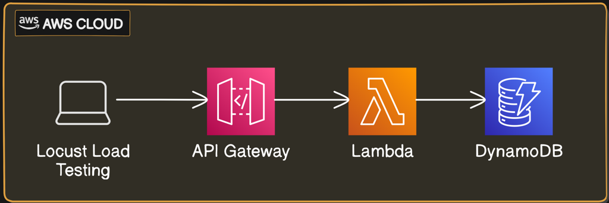

README for Locust Manual - Article 1

Locust Manual Setup Guide
This repository contains scripts referenced in the LinkedIn article on setting up a serverless API using AWS Lambda, API Gateway, and DynamoDB, followed by load testing with Locust.

Overview
In the article, we cover:

Implementing a Serverless Architecture: Creating an API with AWS Lambda, API Gateway, and DynamoDB.
Performing Load Testing: Using Locust to simulate user load and evaluate the performance of your API.
Analyzing Results: Viewing real-time load test results via a web interface.
Understanding Component Connections: Learning how Lambda, API Gateway, and DynamoDB work together seamlessly.
Read the Full Article
For detailed instructions and insights, please refer to the full article on LinkedIn: https://www.linkedin.com/article/edit/7204213038063702016/

Repository Contents
IAM Policies: JSON files for creating IAM policies.
Lambda Code: Python scripts for AWS Lambda functions.
Locust Scripts: Load testing scripts for Locust.
Feel free to explore the scripts and reach out if you have any questions or need further assistance.